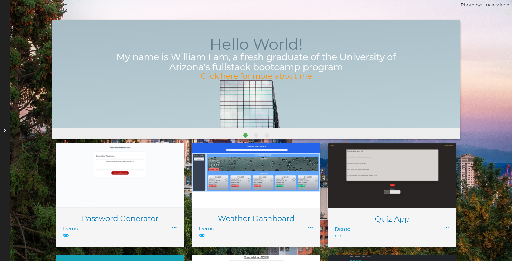

# react-portfolio

My first go at using ReactJS to build a frontend application. I wanted to include as much functionality from everything I've learn as I could without losing out on any aesthetics. The inspiration for how I built this website is from among my friends and peers. The constant cycle of feedback from them allowed the my website to evolve to it's current state. Using tailwind and material css I was able to design the website with a mobile first approach, although it isn't perfect I am constantly trying to improve it. There are still of course plenty of bugs to fix, but I think it's a good direction going forward. There are still tons of feature I wish to implement in the near future.

